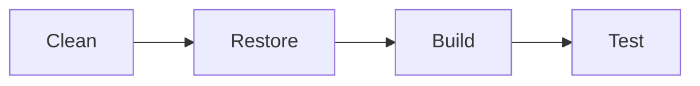

# Items API - Nuke Demo

## Installation

* Install the `nuke` global tool

```shell
dotnet tool install Nuke.Global --global
```

* Create a solution, and at the root level, run the below command

```shell
shell :setup
```

Then follow the setup steps to get a `nuke` build to your solution.

## Build Pipeline



## Run Pipeline

Run below command to run the pipeline using `NUKE`

```shell
nuke --configuration "Debug" --api-key "123456" --password "secret password" --target runtests
```

## Todo

- [x] Include `CSharpier` Format Checks
- [x] Running in Multiple GitHub Environments Using GHA
  - [x] Env Specific Variable Support
  - [x] Env Specific Secret Support
- [x] Using Build Components
- [ ] Publish to Azure
